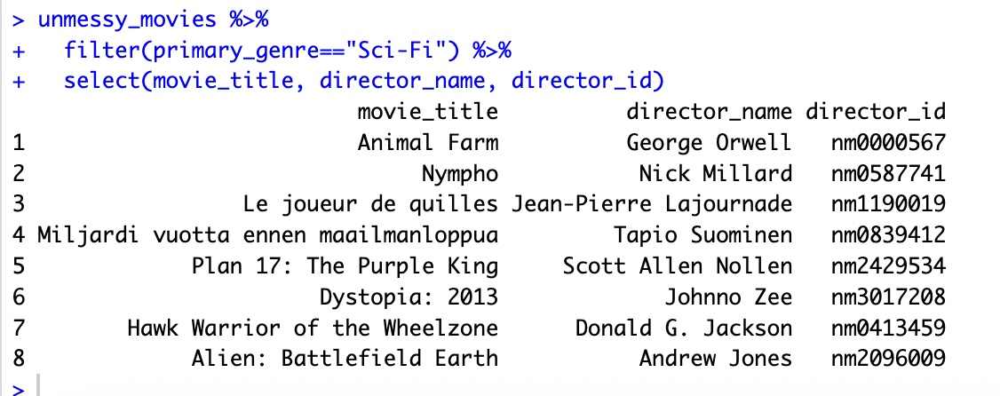
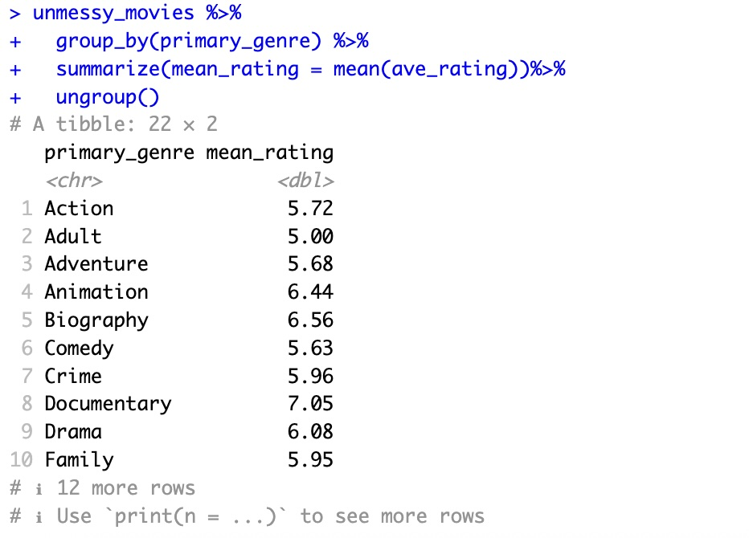

# Data Wrangling with dplyr

`dplyr` is another important package in R that makes it easy to extract and summarize insights from tabular data. Luckily, `dplyr` is included in `tidyverse` and was loaded into R's memory when we called `library(tidyverse)`.

In this section, we're going to cover just the most common `dplyr` functions:

- `select()`: subset columns
- `filter()`: subset rows on conditions
- `mutate()`: create new columns by using information from other columns
- `group_by()` and `summarize()`: create summary statistics on grouped data
- `arrange()`: sort results
- `count()`: count discrete values

## Selecting & filtering 

Selecting and filtering are both techniques to focus in on some chosen data in a data frame. `select()` is used to select specific columns of a data frame. When we call `select()`, the first argument in the parentheses will be the data frame, followed by the columns to keep, separated by commas. 
```R
select(unmessy_movies, movie_title, year, runtime, primary_genre)
```
Since these columns are adjacent to one another in our data frame, we can get the same result by using `:`.
```R
select(unmessy_movies, movie_title:primary_genre)
```

Filtering, on the other hand, is used to select out rows based on conditions. To use `filter()`, you put the data frame as the first argument inside the parentheses, and the conditions as the second. For example, we can filter our data frame by Music genre like so:
```R
filter(unmessy_movies, primary_genre=="Music")
```
We can add further conditions to our filter, seperated by commas. For example, we can filter our data down to action movies under 60 minutes long by running the following code:
```R
filter(unmessy_movies, primary_genre=="Action",
                        runtime < 60)
```
**Practice.** Using the filter function, find how many Animation movies were released before 1990. 

???note "Solution"
    ```R
    # You should filter the data by primary genre and year, like so:
    filter(unmessy_movies, primary_genre=='Animation', year<1990)

    #Your output should include 21 movies. 
    ```

## Pipes

Pipes are a way to do more complicated operations in R, such as selecting and filtering at the same time. Pipes let you take the output of one function and send it directly to the next, which is useful when you need to do many things to the same dataset. 

There are two Pipes in R: the magrittr pipe (installed automatically with `dplyr`) and the native pipe. In this workshop, we will be using the margrittr pipe. Both the pipes are, by and large, function similarly with a few differences (For more information, check [the tidyverse site](https://www.tidyverse.org/blog/2023/04/base-vs-magrittr-pipe/)). The choice of which pipe to be used can be changed in the Global settings in R studio.

Pipes are represented by `%>%` in R. Rather than type it out every time, you can use the following keyboard shortcut: ++ctrl+shift+m++ (on PC) or ++cmd+shift+m++ (on mac). 

Let's start by using pipes to view information about the director for every sci-fi movie. To do this, we want to filter by genre, and then select for director and director ID.
```R
unmessy_movies %>%
    filter(primary_genre=="Sci-Fi") %>%
    select(movie_title, director_name, director_id)
```
Running that command should print the following to your console: 
<figure markdown="span">
    {width=800}
    <figcaption></figcaption>
</figure>

In the above code, we use the pipe to send the interviews dataset first through filter() to keep rows where the primary genre is "Sci-Fi" then through select() to keep only the columns "movie_title", "director_name", and "director_id. Since %>% takes the object on its left and passes it as the first argument to the function on its right, we don’t need to explicitly include the dataframe as an argument to the filter() and select() functions any more.

The dplyr functions by themselves are somewhat simple, but by combining them into linear workflows with the pipe, we can accomplish more complex data wrangling operations.

If we want to create a new object with this smaller version of the data, we can assign it a new name:
```R
scifi_movies <- unmessy_movies %>%
    filter(primary_genre=="Sci-Fi") %>%
    select(movie_title, director_name, director_id)
```
**Practice.** Using pipes, subset the unmessy movies data to include only Action movies and retain only the columns for movie title, year, and average rating. Create a new object with this data, and assign it the name "action_movies."

???note "Solution"
    ```R
    #Your code should look like this: 

    action_movies <- unmessy_movies %>%
        filter(primary_genre=="Action") %>%
        select(movie_title, year, ave_rating)

    #this will produce a data frame object with 3 variables and 467 observations. 
    ```

## Mutate
Frequently you’ll want to create new columns based on the values in existing columns, for example to do unit conversions, or to find the ratio of values in two columns. For this we’ll use mutate().

For example, you might be interested in the number of writers on each movie. For this, we will need to create a new column (variable) countaining a count of the number of writer ids in each row of the `writer_id` column. We will need to start by formatting our `writer_id` column so that each row is a list. Then, we can pipe it into a mutation creating a variable counting the number of items. For this, we will use the function `lengths()`.

```R
unmessy_movies %>%
  mutate(writers_id = strsplit(writers_id,",")) %>%
  mutate(num_writers = lengths(writers_id))
```

**Practice.** How would we change the code above to save our new `num_writers` variable?

???note "Solution"
    To add this new variable to our data frame, we need to assign the data to another object. It's good practice to create a new data frame in cases like this, leaving the original data intact. So, you could do something like this:
    ```R
    unmessy_movies2 <- unmessy_movies %>%
        mutate(writers_id = strsplit(writers_id,",")) %>%
        mutate(num_writers = lengths(writers_id))
    ```

## Split-apply-combine
Many data analysis tasks can be approached using the split-apply-combine paradigm: split the data into groups, apply some analysis to each group, and then combine the results. `dplyr` makes this very easy through the use of the `group_by()` function.

### The summarize() function
`group_by()` is often used together with summarize(), which collapses each group into a single-row summary of that group. `group_by()` takes as arguments the column names that contain the categorical variables for which you want to calculate the summary statistics. Always end your `group_by()` operations with the `ungroup()` function. So, if we wanted to calculate the average rating per primary genre, we could do the following:
```R
unmessy_movies %>%
    group_by(primary_genre) %>%
    summarize(mean_rating = mean(ave_rating))%>%
    ungroup()
```
Running this code should print the following output to your console: 
<figure markdown="span">
    {width=800}
    <figcaption></figcaption>
</figure>

We also have the option of specifying the sort order of our data. To do this, we need to add a `arrange()` function to the end of our pipeline. So, if we wanted to sort the primary genres by their average rating, we could do this: 
```R
unmessy_movies %>%
  group_by(primary_genre) %>%
  summarize(mean_rating = mean(ave_rating))%>%
  arrange(mean_rating)%>%
  ungroup()
```
We can further customize our sorting to be from highest to lowest by adding the `desc()` function. The `desc()` function is nested inside the `arrange()` function like so `arrange(desc(x))`. 

**Practice.** Use the `arrange()` and `desc()` functions to modify the above code so that our output is arranged from highest mean average rating to lowest. Assign the output to a new object called "genre_ratings."

???note "Solution"
    ```R
    genre_ratings <- unmessy_movies %>%
    group_by(primary_genre) %>%
    summarize(mean_rating = mean(ave_rating))%>%
    arrange(desc(mean_rating))%>%
    ungroup()
    ```

## Counting

The `count()` function in `dplyr` lets us count (intuitive, I know) observations. Importantly, we can include arguments that allow us to count observations based on different factors or combinations or factors. 

To use the `count()` function to count the values in a column within a data frame, we need to pipe it from the data frame object. 

For example, let's use the `count()` function to count the number of movies released in each year. 
```R
unmessy_movies %>% 
  count(year)
```

Now, let's add a `sort` argument. This will show us which years had the most movies released. 
```R
unmessy_movies %>% 
  count(year, sort=TRUE)
```
It looks like 2009-11 were the most productive years in our data set! 
