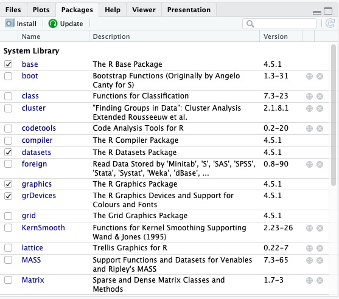

# Basic Syntax & Concepts

Before we start working with our unmessy movies dataset,let's go over some of the basic concepts and syntax in R. 

## Operators
Operators are special symbols or keywords used to perform operations on one or more values. Common operators include:

- Assignment operators. We can use the operators `<-` and `=` to assign a value to a variable/object. When naming an object in R, avoid using the names of fundamental objects (like 'mean), periods, or numbers at the beginning. Try creating variables for the day and month and assigning them values by running the following in the Source Editor: 
```R
day <- 3
month = 10
```
!!!info "Note"
    RStudio allows for several quick keyboard shortcuts. One is to press ++alt+hyphen++ (on PC) or ++option+hyphen++ (on mac) to write `<-`

- Arithmetic operators. The operators `+`, `-`, `*`, and `/` are used for basic mathematical calculations, namely addition, subtraction, multiplication, and division. Try running the following in your Source Editor and watching what appears in the console:
```R
4+2
4/2
```
???note "Output"
    ```R
    > 4+2
    [1] 6
    > 4/2
    [1] 2
    ```
- Comparison operators. The operators `<`, `>`, and `==` return a logical value when used to compare two things. Try running the following:
```R
4!=3
4<3
```
???note "Output"
    ```R
    > 4!=3
    [1] TRUE
    > 4<3
    [1] FALSE
    ```
- Logical operators. The operators `&` (and), `|` (or), and `!` (not) are used to perform logical operators. These are a bit more complicated to use, but here is a simple example:
```R
#the single & operator represents an element-wise logical AND. It will return TRUE if both corresponding elements are true. Run the following:
c(TRUE,TRUE,FALSE) & c(TRUE,FALSE,FALSE)

#Running the code above should return the following output:
[1]  TRUE FALSE FALSE
```
- Other miscellaneous operators:
    - The hash sign `#` indicates a comment in the code
    - The colon sign `:` creates a sequence of numbers 
    - The square brackets `[]` indexed an object, such as a vector
    - The dollar sign `$` accesses a variable from a dataframe
    - The percent sign `%` is used for some special operators to string operations together
    - The double colon `::` accesses functions or variables from a specific package

## Data types
The most common data types in R are:

1. Numeric data (numbers with decimal points, either integers or floats)
2. Character data (text strings)
3. Factor data (categorial data with a fixed set of values or levels)
4. Logical data (boolean values or logical values)

Data types are important because they determine how data is stored, processed, and analyzed. Choosing the appropriate data type can help you optimize your memory usage, perform the necessary data manipulations, conduct the appropriate statistical analyses, and create effective visualizations of your data.

## Data frames

Data frames are a very common type of data structure used in R. A data frame is a two-dimensional tabular structure representing a grid of data, where each row represents an observation and each column represents a variable. 

## Vectors

Vectors are another important type of data structure in R. A vector is a basic, one-dimensional data structure that represents a sequence of values of the same data type, whether numbers or letters. 

Creating vectors is straightforward: you just use the assignment operator and the **c()** function, which combines values. Try running the following code to make some vectors describing the Hollywood Chris's:
```R
chris_vector <- c('pratt','hemsworth')
chris_age_vector <- c(44,46,42,45)
```
Now that you've created these two vectors, you should see them in your environment in the top right pane of the RStudio console.

!!!info "Note"
    Be sure to include quotation marks around the text data you're combining into a vector. If you do not have them, R will assume that you are referring to objects, not data values.

You can call functions on vectors. For example, you can inspect the length, structure, and type of vectors. Run these three functions. Your output will appear in the console - did you get what you expected to see?
```R
length(chris_age_vector)
str(chris_age_vector)
typeof(chris_vector)
```
???note "Output"
    ```R
    > length(chris_age_vector)
    [1] 4
    > str(chris_age_vector)
     num [1:4] 44 46 42 45
    > typeof(chris_vector)
    [1] "character"
    ```

It is also fairly straightforward to add elements to the beggining or end of your vector. Run the following code in your source editor or console:
```R
chris_vector <-c(chris_vector, "pine")
chris_vector <-c("evans",chris_vector)
```
Once you've done this, you should see the values of chris_vector change in the environment pane.

Importantly, if you try to put data of different types into one vector, R will coerce them automatically to all be the same type.

Let's try creating a vector including the last name and age for two of the Hollywood Chris's. Basically, we are trying to make a vector with two strings and two integers.
```R
name_age_vector <- c("evans", 44, "pratt", 46)
```
What happens to the data in our vector? Call `str(name_age_vector)`. How has R changed it? 

???note "Solution"
    R will have coerced the vector into a character vector. This means that all four values, the ages included, will be treated as text. 

    When different data types are combined within a single atomic vector, R applies a coercion hierarchy to determine the resulting data type of the entire vector. Data are coerced from simplest to richest, followng the order of Logical -> Integer -> Numeric -> Complex -> Character. 
    
    For example: If a vector contains both logical and integer values, all logical values will be coerced to integer (e.g., TRUE becomes 1, FALSE becomes 0). Or, if a vector contains numeric and character values, all numeric values will be coerced to character (as happened in our example).

## Functions

A function is a 'canned script' that automates a block of code that performs a specifc task and can be easily called and executed by the user. Functions are an essential component of programming in R. 

When R is installed, it comes with the default package `base` which contains a number of useful built-in functions. These include:

- `mean()` calculates the mean of a vector of numbers
- `sd()` calculates the standard deviation of a vector of numbers
- `str()` displays the structure of an R object
- `table()` creates a frequency table of a vector or factor
- `plot()` creates a basic plot of data

Try calculating the average age of the Hollywood Chris's using some of R's built-in functions. What function will you use? What output do you get? 
???note "Output"
    ```R
    > mean(chris_age_vector)
    [1] 44.25
    ```
You can also define your own functions in R using the function `function`, like so: 
```R
my_function <- function (arguments){
    R code to be excuted
    }
```
## Packages

Different packages in R will come with their own built-in functions. Packages are collections of data, functions, and documentation. Packages are how we expand R beyond the base package. 

R packages are developed by the user community, and are all available for free. The **Packages** tab in RStudio lists all packages already installed in your R instance. 

<figure markdown="span">
    {width=800}
    <figcaption>All already installed packages are listed under the Packages tab.</figcaption>
</figure>

For a full list of all published packages, you can check out the [R website](https://cran.r-project.org/web/packages/available_packages_by_name.html).

Packages only need to be installed once. Once they're installed, though, you do need to call them before you can use them and their built-in functions. Let's practice installing and calling packages with [`tidyverse`](https://cran.r-project.org/web/packages/tidyverse/index.html), a very common R package for simple data work. 
```R
#installing a package
install.packages('tidyverse')

#calling a package
library(tidyverse)
```
Now you should see `tidyverse` appear in the Packages tab. 

Alternatively, you can install a package by clicking the **Install** button on the top left of the Packages pane. Similarly, you can load a package by checking the box beside the installed package. In both cases, you will see the work that R is doing to install and load the package in the Console. 

## Missing data
As a progamming language made for analysing datasets, R includes ways of dealing with missing data. Missing data is represented as `NA` in R. When doing operations on numbers in R, most functions will return `NA` if there are missing values in your data. 

One way to sidestep this problem is to include the argument `na.rm=TRUE` in your operation. This tells R to calculate the result while ignoring missing values. 

To test this out, let's start by adding a missing value to our `chris_age_vector` and trying to calculate the mean. 
```R
chris_age_vector <- c(NA, chris_age_vector)
mean(chris_age_vector)
```
What happens when we try to calculate the mean? How do we fix our function? 
???note "Solution"
    ```R
    #if we want to calculate the mean of our chris age vector, we need to add an argument to remove the missing value from our calculation.
    
    mean(chris_age_vector, na.rm=TRUE)

    #When you run this new function, you should get an output of 44.25. 
    ```
You can also check whether your data has any missing values using `is.na()`. This command returns a logical value of either TRUE or FALSE depending on whether there are missing values in your object or not. 

## Saving your work

Saving your work is a crucial piece of the workflow in R. Throughout this workshop, we will be saving our work, including the data frames, plots, and script we create. 

You can save your script simply by clicking the save button (the one that looks like a floppy disk) in the tool bar of the Source Editor. From there, it will prompt you to choose a name and location to save your file. 

Plots can be saved in two ways. One option is to click the **Export** button in the tool bar of the **Plot** tab in the bottom right hand pane of RStudio. Alternatively, you can run code in your script to save your plots. The specific code will vary across packages; to save your plots in `ggplot2`, which we will cover towards the end of this session, you can run the following code: 
```R
ggsave("your_plot_name.png", plot = your_plot)
```

Finally, to save data frames, you'll need to write them into the folder where you'd like them saved. We'll practice this later, but the basic code for saving a dataframe is as follows:
```R
write.csv(data_frame_name, "./path")
```
