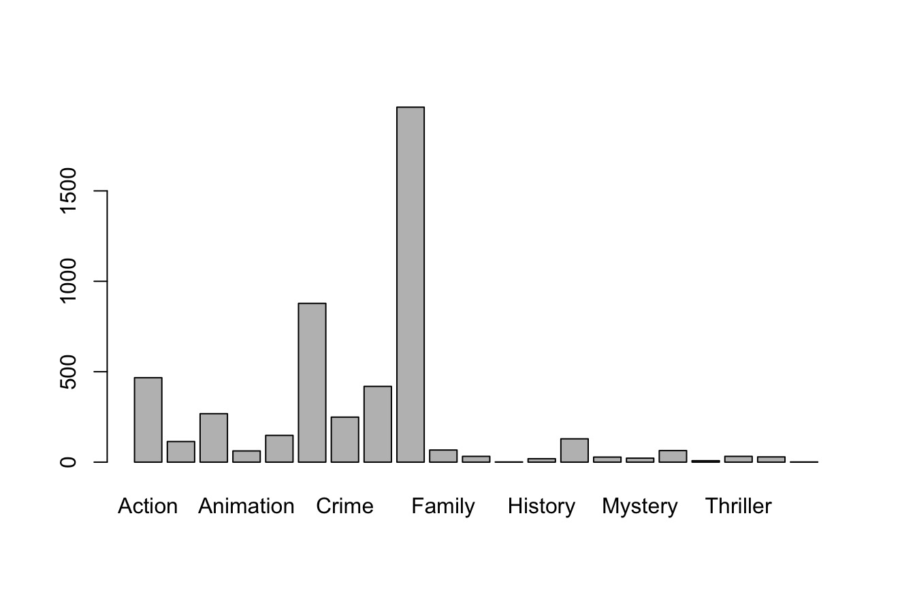

# Inspecting, Subsetting, and Examining Data

Now that our data is uploaded into R, we can start to examine it. A viewer tab will likely have opened when you imported your data (in the Source Editor), but if not, you can run the command `View(unmessy_movies)` to see it. Remember, R is case sensitive, so be sure to write **View** not **view**. 

Our dataset includes twelve variables. Try running `names(unmessy_movies)` to view a list of the variable names. You should see a list containing the following:

- **movie_id** (provides a unique identifier for each movie in the dataset)
- **movie_title** (the title of the movie, in English)
- **year** (the year of release for the movie)
- **runtime** (the runtime of the movie)
- **genres** (the genres under which the movie is listed in IMBD)
- **primary_genre** (the primary genre for the movie)
- **ave_rating** (the average rating of the movie)
- **num_votes** (the number of votes used to calculate the rating)
- **director_id** (a unique identifier for the movie's director)
- **director_name** (the full name of the movie's director)
- **writers_id** (a list of unique identifiers representing each of the writers of the movie)
- **writers_name** (a list of the names of the writers of the movie)

## Inspecting data

`names()` is only one of a number of functions we can call to inspect our data frame. Let's try a few more: 
```R
dim(unmessy_movies) #will return a vector with the dimensions of the table (number of rows, and number of columns)

str(unmessy_movies) #will return information on the structure of the object (a data frame in this case) and on the class, length, and content of each column

head(unmessy_movies) #will show the first six rows of the data frame
tail(unmessy_movies) #will show the last six rows of the data frame
```
## Subsetting data frames
R allows us to extract specific information from data frames, if we are only interested in some subset of the data. To access this specific data, you need to specify the indices (the location) of the data. This is done by  listing the row number of the data point  followed by the column number inside square brackets. Try running the following code: 
```R
unmessy_movies[2,2]
```
Here, we have extracted the data found in the second row and second column of the unmessy_movies data frame. You should get the following output: 

!!!note "Output"
    ```R
    [1] "The Abyss"
    ```
There are a number of ways to customize your subset. For one, you can subset out a range of rows and/or columns by using `:`, which creates a numeric vector of ordered integers. You can also subset all rows or columns by leaving the row or column position in the square brackets blank. Finally, by using the `-` sign, you can exclude a row or column. Let's give it a try! Run the following code and note your output.
```R
unmessy_movies[2,1:5]
unmessy_movies[ ,2]
unmessy_movies[2,-1]
```
!!!note "Output"

    1. You should get the data from columns one thorugh five for row two (the movie_id, movie_title, year, runtime, and genres)
    2. This will give you the values from column 2 for every row in the data frame
    3. This will give you the data from row two with the exception of column one (the movie_id)

**Practice.** It might also be useful to turn our subsets into their own objects. To do this, we need to assign the subset to another object. Let's practice this by creating a subset of just the first 100 rows of the dataframe. Name your new data frame "movies_first100."

???note "Solution"
    ```R
    movies_first100 <- unmessy_movies[1:100, ]
    ```
Before we move on, let's practice saving data by saving our data frame "movies_first100" to the data outputs folder. You may need to modify the file path in the function if you're using a PC.  
```R
write.csv(movies_first100, "./data_output/movies_first100.csv")
```

## Using factors

Factors are a type of data structure designed to deal with categorical data. Factors are particularly useful when creating plots or doing simple statistical analysis on categorical/textual data. 

Factors store categorical data as integers associated with labels. These labels can be ordered (ordinal) or unordered (nominal). They are ordinal when the order of the integers matters (like in a scale), and nominal when it does not (like in a list of colours).

While factors look (and often behave) like character vectors, they are actually treated as integer vectors by R. So you need to be very careful when treating them as strings.

Once created, factors can only contain a pre-defined set of values, known as levels. By default, R always sorts levels in alphabetical order.

We can use factors to better understand the distribution of genres in our data frame. First, let's work through the codeblock below to identify the different genres. 
```R
#Start by creating a factor from the primary_genre variable/column
genres <- factor(unmessy_movies$primary_genre)

#Next, use the levels() function to print a list of genres. You should see 22 different genres. 
levels(genres)
```
Now, let's say we'd like to combine the **Music** and **Musical** genres (given that they're both music-y). To do that, we would run the following: 
```R
genres <- fct_recode(genres, Music="Musical")
```
Now, run the `levels()` command again. What change do you see? 

Finally, let's plot out the distribution of our 21 genres. To do this, run the `plot(genres)` command. You should see a plot appear in the bottom right pane.  

<figure markdown="span">
    {width=800}
    <figcaption>Simple plot of the twenty one genres in our data frame.</figcaption>
</figure>

Since we're working in `base` R, we can save the plot by navigating to the **Export** button on the **Plots** pane. From there, save your plot as a jpeg in the `figs_output/` folder. There are other ways to save graphs which we will cover later. 

