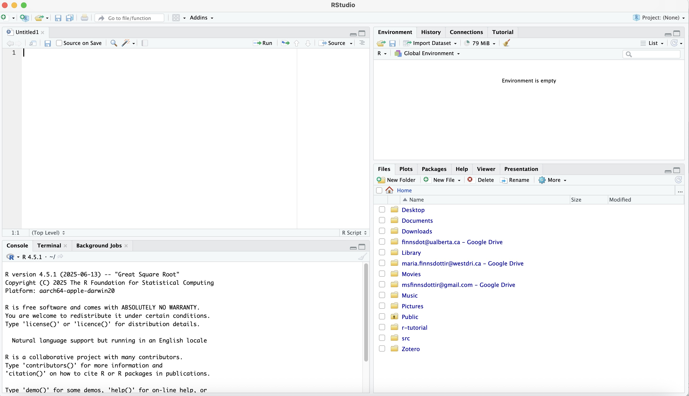

# R and RStudio

<i> What is R? </i> R is a specialized programming language for statistics. While R does have a fairly steep learning curve (compared to SPSS or STATA), it is free, open-source, extendable, customizable, and reproducible. 

RStudio, on the other hand, is an integrated development environment (IDE) for R. Basically, it’s an easier and more intuitive way to work with R. When you use RStudio, you work with your data and write your scripts in the IDE, and then it executes your commands in R in the background. This is why you need both R and RStudio to use RStudio. 

## Using RStudio

When you open RStudio, you’ll see the interface which has a toolbar (with buttons including File, Edit, Code, etc.) and four panes. 

<figure markdown="span">
    {width=800}
    <figcaption>RStudio's interface.</figcaption>
</figure>

On the top left is the **Source Editor**. This is where your script will be. You should write your code and execute it from a script file in the source editor, especially if you want to save it for future use or for sharing. 

!!! info "Note"
    If this is your first time opening RStudio, the source editor might not show up. If that happens, just click on **File** in the toolbar, navigate to **New File**, and then click on **R Script**. A script file titled "Untitled 1" should appear in your source editor. 

On the bottom left is the Console. The console shows the work that R is doing. You can also write commands in the console, but they will not be saved when you close the program. 

The top right pane contains the tabs **Environment**, **History**, **Connections**, and **Tutorial**. The first two are more useful: **Environment** lists all the objects you have in your workspace (including dataframes and variables), while **History** shows the commands that have been entered. 

Finally, the bottom right pane includes the tabs **Files**, **Plots**, **Packages**, **Help**, **Viewer**, and **Presentation**. **Files**, as the name implies, allows you to see the files on your computer and to navigate your file system. **Plots** allows you to view any graphs or plots you create in RStudio. 

Next, the **Packages** tab opens a list of all installed packages and links to their documentation. The **Help** tab, meanwhile, provides links to all of R's help documentation. 

For more information on all these tabs, check out the [RStudio IDE cheat sheet](https://posit.co/wp-content/uploads/2022/10/rstudio-ide-1.pdf).

!!! info "Note"
    It is a good idea to format RStudio so that it doesn’t automatically save your workspace. Automatically saving your workspace takes up a lot of memory, and could make troubleshooting and sharing code harder. 
     
     
    To do this, go first to **Tools** and then select **Global Options**. From there, select **General** and select **Never** for **Save workshop to .RData on exit** under the **Workspace** heading.

There are two ways to run code in R. 

1. Press the **Run** button on the top right of the Source Editor pane. This will run the line where your cursor is. To run more than one line of code, highlight the lines and then press one. 
2. Use the keyboard shortcut ++ctrl+enter++ (on windows) or ++cmd+enter++ (on macbook). This will run the line where your cursor is. To run more than one line of code, highlight the lines and then use the keyboard shortcut. 