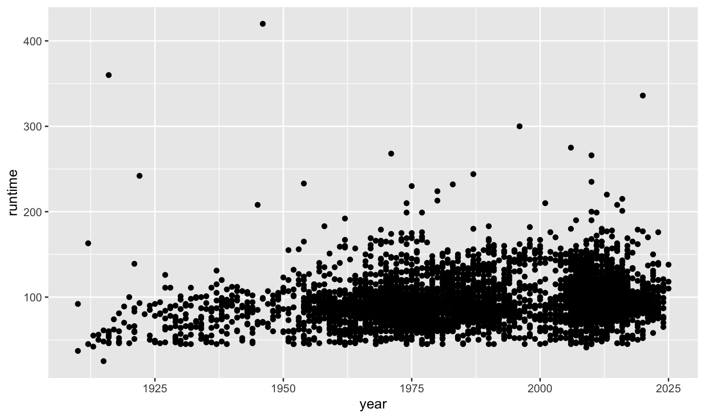
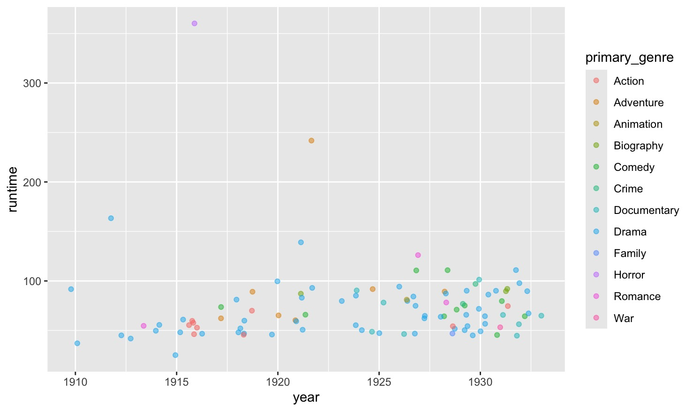

# Data Visualisation

There are many ways to create visualizations in R, including and beyond the plots in `base` R. While `base` R is great for simple and quick visualizations (like the distribution of genres plot we created earlier), there are other packages that are better for creating complex and customizable ones - including `ggplot2`. `ggplot2`, like `dplyr`, is included in the `tidyverse` package. 

`ggplot2` makes it simple to create complex plots from data stored in a data frame. It provides a programmatic interface for specifying what variables to plot, how they are displayed, and general visual properties. Therefore, we only need minimal changes if the underlying data change or if we decide to change from a bar plot to a scatterplot. This helps in creating publication quality plots with minimal amounts of adjustments and tweaking.

## Building plots

ggplot graphics are built step by step by adding new elements. Each chart built with `ggplot2` must include the following:

- Data
- Aesthetic mapping (aes)
    - Describes how variables are mapped onto graphical attributes
    - Visual attribute of data including x-y axes, color, fill, shape, and alpha
- Geometric objects (geom)
    - Determines how values are rendered graphically, as bars (geom_bar), scatterplot (geom_point), line (geom_line), etc.

Thus, the template for graphic in  `ggplot2` is:
```R
<DATA> %>%
    ggplot(aes(<MAPPINGS>)) +
    <GEOM_FUNCTION>()
```

Using this template, let's make a ggplot plotting the relationship between runtime and year of release. 
```R
unmessy_movies %>%
  ggplot(aes(x=year, y=runtime))+geom_point()
```
This should produce a plot similar to this one, in the bottom right pane of your RStudio window. 

<figure markdown="span">
    {width=800}
    <figcaption></figcaption>
</figure>

## Customizing plots

`ggplot2` offers a variety of options for customization. You can add customize the transparency of the points in your plots by using a `alpha` argument in your `geom_point()` function. You can use `geom_jitter()` to include jitter in your plots. 

You can also use a `color` arugment inside the geom_function to customize the colour of your data points. For this, you can use either a set colour, or assign colours based on another variable. Let's give this a try with a smaller dataset, the movies_first100 data frame.  
```R
colourful_plot <- movies_first100 %>% 
  ggplot(aes(x=year, y=runtime)) + geom_jitter(aes(color=primary_genre), alpha=0.5)
```
<figure markdown="span">
    {width=800}
    <figcaption></figcaption>
</figure>

Feel free to play around with the colours, transparency, jitter, and style. For more on the customization options, check out the [ggplot2 documentation](https://ggplot2.tidyverse.org/reference/index.html) and the [ggplot2 cheatsheet](https://github.com/rstudio/cheatsheets/blob/main/data-visualization.pdf).

As you see above, we can also assign plots to objects. We don't need to do this to see them, but it can be useful for keeping track of our graphics, and for saving them. Use the following code to save your plot. 

```R
ggsave("./fig_output/colourful_jitterplot.png", plot=colourful_plot)
```

!!!note
    You do not need to include the `plot` argument in your `ggsave()` function. If you leave it blank, it will simply save the most recent plot. 

There are also options for plotting more categorical data. The type of plot being produced is dtermined by the geom function - the second piece of the ggplot formula. In addition to `geom_point` and `geom_jitter`, which we have already seen, you can also use `geom_boxplot` to make box plots, or `geom_bar` to make barplots. 

Let's try making a boxplot to visualize the differences in average ratings across genres. Boxplots can also have customized colours. Try running the following:
```R
unmessy_movies %>%
  ggplot(aes(x = primary_genre, y = ave_rating)) +
  geom_boxplot(aes(fill=primary_genre))
```

We can also add custom titles to our plots using different arguments within a `labs()` function, including a `title`, `subtitle` and `caption`. The `labs()` function is added to the end of the ggplot formula with a `+`.

**Practice.** Let's modify our boxplot to make it more readable and prettier! Update the code above to include the title "Average movie rating by genre,' and to include the primary genre variable as the fill. Finally, add the following to the end of your codeblock to clean up the genre labels on the x-axis: `theme(axis.text.x = element_blank())`. Be sure to save your plot afterwards. 

???note "Solution"
    ```R
    unmessy_movies %>%
        ggplot(aes(x = primary_genre, y = ave_rating)) +
        geom_boxplot(aes(fill=primary_genre)) +
        labs(title="Average movie rating by genre") +
        theme(axis.text.x = element_blank())

    ggsave("./fig_output/colourful_boxplot.png")
    ```
You should end up with a plot similar to this one: 

<figure markdown="span">
    {width=800}
    <figcaption></figcaption>
</figure>


